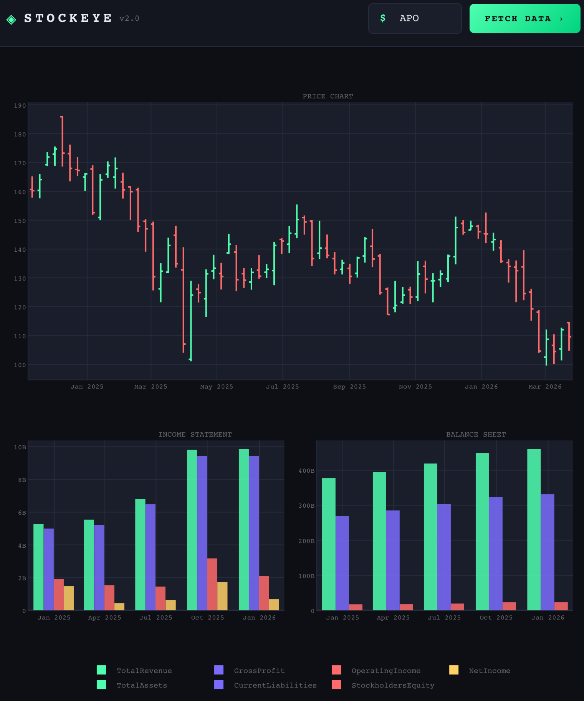

# Stockeye

A lightweight stock research tool that combines price history and fundamental data in a single dashboard — built to spot divergences between market pricing and underlying business performance.

## Background

Most screeners show price or fundamentals in isolation. Stockeye overlays both on the same timeline, making it easier to see when the market is pricing in a story that the numbers don't support — and vice versa.

The focus is on multiple dynamics: situations where valuation multiples have compressed or expanded beyond what fundamentals justify. Since multiples tend to mean-revert over time, these divergences can point toward asymmetric setups where the risk/reward is skewed in one direction.

## What it shows

- **Price chart** — Weekly OHLC candlestick chart for the past 2 years
- **Income Statement** — Revenue, Gross Profit, Operating Income and Net Income over the last quarters
- **Balance Sheet** — Total Assets, Current Liabilities and Stockholders' Equity over the same period

## Usage

1. Run the app: `python app.py`
2. Open your browser at `http://localhost:8050`
3. Type a valid ticker symbol into the **TICKER** field (e.g. `AAPL`, `MSFT`)
4. Click **FETCH DATA**

Data is cached locally after the first fetch, so subsequent loads for the same ticker are fast.

## Project Structure

```
├── app.py     # Plotly Dash web app — layout and chart callback
└── db.py      # Database class for local caching of price and fundamental data
```

## Dependencies

```
dash
plotly
pandas
yfinance
```

